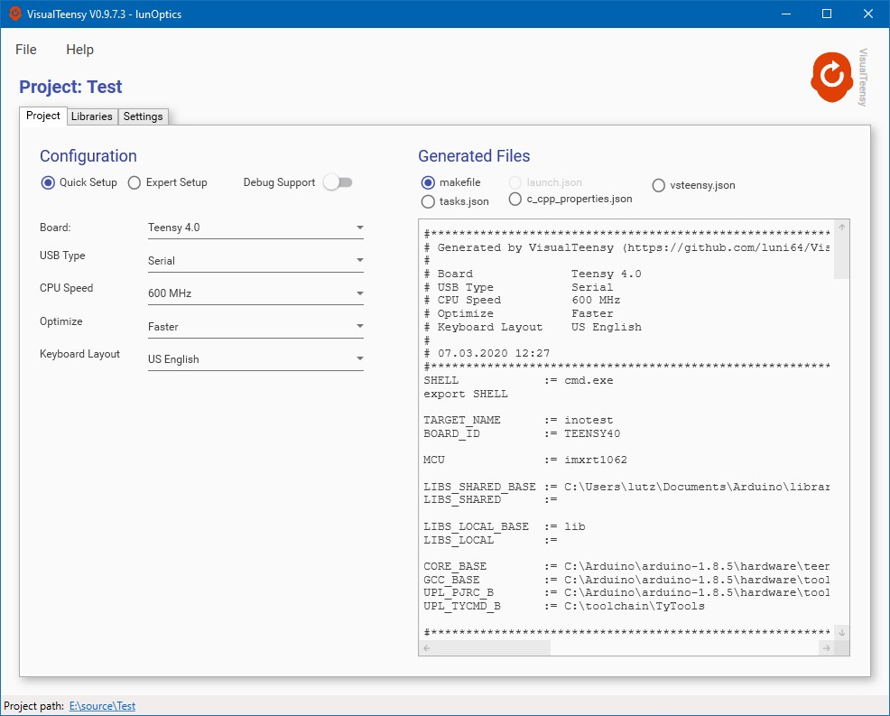

# VisualTeensy
VisualTeensy is a lightweight Windows utility which fully automates the generation of Teensy projects for [vsCode](https://code.visualstudio.com/), a modern, open source code editor.

VisualTeensy does not touch any global or user level settings in vsCode and does not install any extension to vsCode. It only creates some Json control files (tasks.json, c_cpp_properties.json, launch.json) and a makefile and copies them into the appropriate subfolders of your project. After you have generated the project with VisualTeensy, you can use the native commands of vsCode to create your sketch and upload it to the board.

VisualTeensy is open source and is published under the [MIT Licence](LICENCE).

<!-- vscode-markdown-toc -->
* [Quick Start Guide](#QuickStartGuide)
	* [Installation](#Installation)
	* [Test Project](#TestProject)
	* [Compiling and Uploading](#CompilingandUploading)
* [Workflows (Best Practice)](#WorkflowsBestPractice)
	* [Generate a New Project](#GenerateaNewProject)
	* [Edit an existing VisualTeensy Project](#EditanexistingVisualTeensyProject)
	* [Using Libraries](#UsingLibraries)
	* [Generate Self Contained Projects](#GenerateSelfContainedProjects)
		* [Freeze the used Compiler](#FreezetheusedCompiler)
		* [Freeze the Teensyduino Core Libraries](#FreezetheTeensyduinoCoreLibraries)
		* [Freeze Third Party Libraries](#FreezeThirdPartyLibraries)
	* [Use the Arduino Builder](#UsetheArduinoBuilder)
	* [Open an Arduino IDE Project](#OpenanArduinoIDEProject)
* [Expert Settings](#ExpertSettings)

<!-- vscode-markdown-toc-config
	numbering=false
	autoSave=true
	/vscode-markdown-toc-config -->
<!-- /vscode-markdown-toc -->

## <a name='QuickStartGuide'></a>Quick Start Guide

For those who want to give VisualTeensy a quick try without reading into the documentation here some instructions:

### <a name='Installation'></a>Installation
- Install vsCode and the [c/c++ extension](https://marketplace.visualstudio.com/items?itemName=ms-vscode.cpptools).
- Download the latest VisualTeensy binaries from the [releases section](https://github.com/luni64/VisualTeensy/releases) and unzip in any convenient location.
- On first startup, VisualTeensy will ask you for an Arduino installation folder. If you provide this information the startup code will fill in the default settings accordingly.

### <a name='TestProject'></a>Test Project
- Generate an empty folder somewhere and name it whatever you like (well, spaces are never a good idea...).
- Open this folder in VisualTeensy (*File | Open*) and select the settings you need  (i.e. board USB type etc...).
- Do a *File | Save* to generate the project.
- From this point on you don't need VisualTeensy anymore and can close it if you like.

### <a name='CompilingandUploading'></a>Compiling and Uploading

You now have all required files including a simple, autogenerated main.cpp containing code to blink the built in LED.

- Open the project folder with vsCode (usually VisualTeensy does this automatically for you after generating the project)

- To compile, you use *CTRL+SHIFT+B* and choose 'Build' from the menu.

- To upload to the TeensyBoard you can use one of the uploaders configured in the VisualTeensy Setup-Tab. They are available in the build menu (*CTRL+SHIFT+B*)

**That's it!**


Below a short video, showing the described process (click on image to start the video on YouTube).

[](https://youtu.be/UyrZ7ogx67Q)


## <a name='WorkflowsBestPractice'></a>Workflows (Best Practice)

### <a name='GenerateaNewProject'></a>Generate a New Project

To generate a new project you can generate an empty folder with your file explorer and open this folder with VisualTeensy. For details, have a look at the [Quick Start Guide](#QuickStartGuide)  and the corresponding video for the details. VisualTeensy will generate the following folder structure:

```
 Test
 ├── makefile
 ├── src
 │   └── main.cpp
 ├── .vscode
 │   ├── c_cpp_properties.json
 │   └── tasks.json
 └── .vsteensy
     ├── build
     └── vsteensy.json
```

Generated files:

- ```c_cpp_properties.json``` contains settings for the intellisense engine.
- ```tasks.json``` defines the entries in the build menu.
- ```vsteensy``` keeps the settings done in VisualTeensy.
- The makefile is, well, the makefile.
- The build folder will contain the generated output files (*.hex, *.elf, *.list) and the intermediate object files.


### <a name='EditanexistingVisualTeensyProject'></a>Edit an existing VisualTeensy Project
To edit an existing project which was originally generated by VisualTeensy, you simply open the project folder in VisualTeensy. VisualTeensy will read in the project settings and you can change them as you like. When you are done, just update the project (FILE | SAVE) to activate the new settings and recompile.

**Note:** VisualTeensy will never delete or overwrite any source files. However, it invalidates the build folder when saving a project to make sure everything gets recompiled with the new settings.


### <a name='UsingLibraries'></a>Using Libraries

VisualTeensy doesn't attempt to be smarter than you and does not do any
library dependency analysis. This means that you have to specify which libraries
(and possibly which dependent libraries) you want to use in your project. If you
are used to the Arduino IDE this may sound inconvenient but usually this is done
in a few seconds and gives you full control over the used libraries.

Here a quick video showing how to use the library manager of VisualTeensy by
compiling an example sketch from the [NXPMotionSense](https://github.com/PaulStoffregen/NXPMotionSense) library

[](https://youtu.be/8oTSou1I3IM)


### <a name='GenerateSelfContainedProjects'></a>Generate Self Contained Projects
General life experience shows that software that works perfectly today can cause problems a few years later. Usually, the issues start after compiler libraries or IDEs have been replaced by newer versions. For small fun projects this is not a big deal. However, if you depend on the software remaining maintainable for a long time, it is important to keep the build environment under control. In the following I describe how such problems can be prevented with VisualTeensy.

First you need to activate the expert setup in the Project-Tab which exposes the possibility to freely choose the location of the Hardware Folder (Teensyduino core libraries) and the location of the used compiler.


This in principle would allow you to freeze the complete toolchain (compiler + Teensyduino) by copying it to your project folder. However, this would certainly be an overkill. Instead, I suggest to setup a toolchain folder containing subfolders for current and historic compilers as well as so far used Teensyduino versions and uploaders like the TyTools or Teensy.exe.

Here an example of such a toolchain folder:

```
toolchain
├── gcc
│   ├── gcc-arm-none-eabi-4_8-2014q3-20140805-win32
│   ├── gcc-arm-none-eabi-5_4-2016q3-20160926-win32
│   └── LLVM
├── Teensyduino
│   ├── current_clone
│   ├── td_141
│   ├── td_142
│   ├── td_146
│   ├── td_147
│   └── td_150
├── TyTools
│   ├── TyTools-0.8.11-16-gc874426-win64
│   ├── TyTools-0.9.0-7-g3825182-win64
│   └── TyTools-0.9.0-win64
└── VisualTeensy
```

#### <a name='FreezetheusedCompiler'></a>Freezing the Compiler
To freeze the compiler used in your project you can either
- Copy it from your Arduino installation ```Arduino\hardware\tools\``` (copy the complete arm subfolder)
- Download it from the [ARM developer site](https://developer.arm.com/tools-and-software/open-source-software/developer-tools/gnu-toolchain/gnu-rm/downloads)
- Download GCC from [Launchpad](https://launchpad.net/gcc-arm-embedded/+series) which keeps older versions < v7.0.

After that point the compiler setting to the corresponding folder in the toolchain directory.

#### <a name='FreezetheTeensyduinoCoreLibraries'></a>Freezing the Teensyduino Core

The same applies for the Teensyduino core libraries. Just copy the folder ```\Arduino\hardware\teensy\avr``` to your toolchain folder, rename it accordingly and point the
Hardware Folder setting to it.


#### <a name='FreezeThirdPartyLibraries'></a>Freeze Third Party Libraries

Freezing third party libraries is easy. Every library (except those from the "Shared Library" repository) will be copied to the project folder per default.


### <a name='UsetheArduinoBuilder'></a>Use the Arduino Builder
If you prefer to use the Arduino Builder instead of a standard c++ build you can select "Arduino-Builder" in the build system options on the settings tab.


If you select this option VisualTeensy will generate a slightly different project structure. Instead of a ```src/main.cpp``` it will generate a .ino file with the same name as the project folder and place it in the project root. Also disables the library tab will be disabled since the Arduino Builder will search for the libraries according to the Arduino rules. The generated makefile will simply call the Arduino Builder build the project.

```
Test
├── makefile
├── Test.ino
├── .vscode
│   ├── c_cpp_properties.json
│   └── tasks.json
└── .vsteensy
    ├── build
    └── vsteensy.json
```


**Note:** VisualTeensy will never delete or override any source files. Thus, if you change this setting for an existing project you will have both a 'project'.ino and a 'src/main.cpp' file in the project. Since both files contain setup() and loop() you may get compile errors. Depending on the project type please **delete either main.cpp or 'project'.ino manually** in this case.

### <a name='OpenanArduinoIDEProject'></a>Open an existing Arduino IDE Project
You can also 'import' an Arduino IDE project. Just open the project folder in VisualTeensy and make sure that you select Arduino-Build System on the settings-tab **after** opening the folder. If you now generate the project (FILE | SAVE), VisualTeensy will add the required setup and config files for vsCode and you can build as usual. The added files do not conflict with the Arduino IDE so that you can switch between it and vsCode without problems.

**Note:** The Arduino IDE currently does not save any information about the used settings (board, USB-Type etc.) in the project folder. Thus, you need set those manually the first time you open the Arduino project folder.

